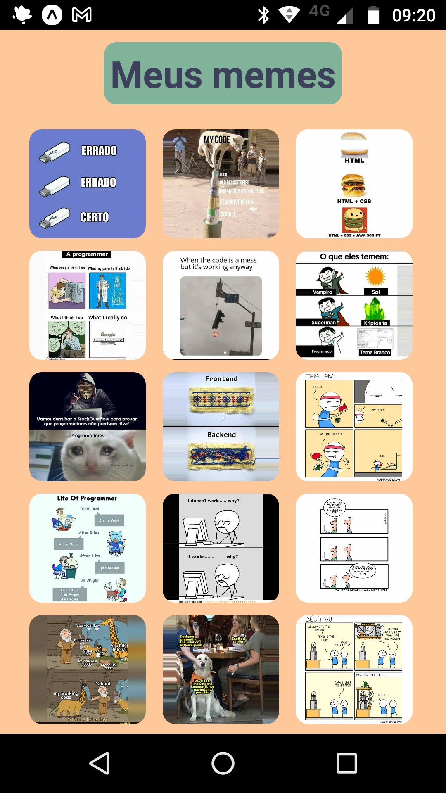

<h2>Meme Project - React Native</h2>

 

<ul>
<li>React Native</li>
</ul>

 

 Project developed during Senai's DEVinHouse course (2022/2023).

 This Project lists programmer jokes based on a fake API query.

 

    

 

    

